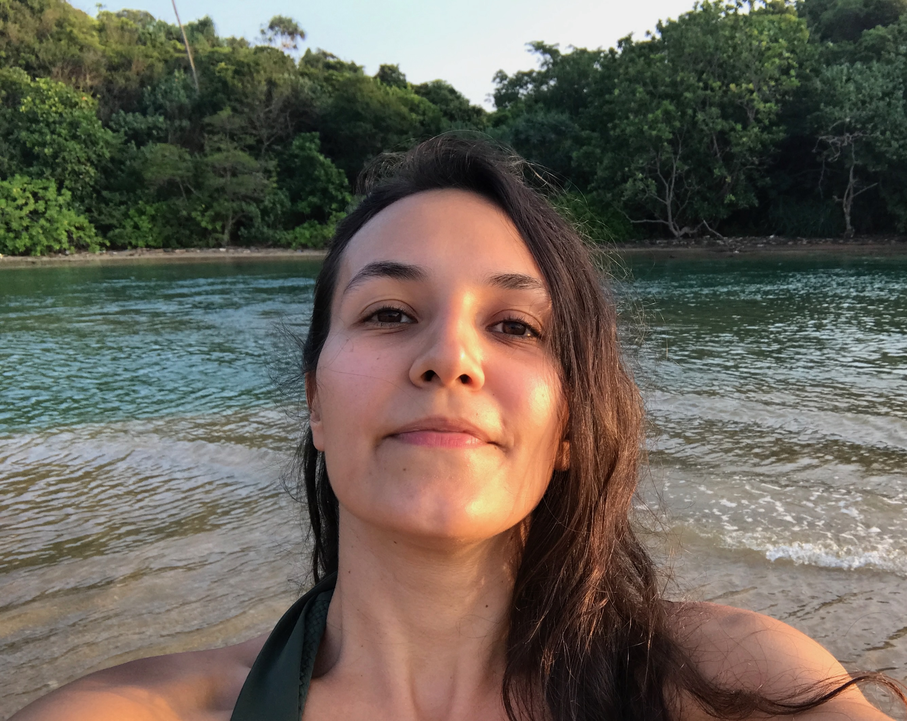

# Şeyda Gündüz — personal website

A very simple, compact personal website made with plain HTML and CSS. It has no
dependencies, build step, or framework.

## Run it locally

The quickest option is to open `index.html` directly in your browser.

For a local web server, open a terminal in this folder and run:

```bash
python3 -m http.server 8000
```

Then visit <http://localhost:8000>.

To stop the server, return to the terminal and press `Ctrl+C`.

## Personalise it

Open `index.html` in any text editor. Near the bottom, replace:

- `your.email@example.com` with your email address
- each `href="#"` with your LinkedIn, GitHub, and CV links
- “To be decided” with your favourite book and composer when ready

To add your own photo, replace the `<div class="photo-placeholder">...</div>`
near the top of `index.html` with:

```html

```

Save your photograph as `profile.jpg` in the same folder, then add this rule to
`styles.css`:

```css
.profile-photo {
  width: 100%;
  aspect-ratio: 4 / 5;
  object-fit: cover;
}
```

Most colours and layout values are collected at the top of `styles.css` under
`:root`, so they are easy to change.
